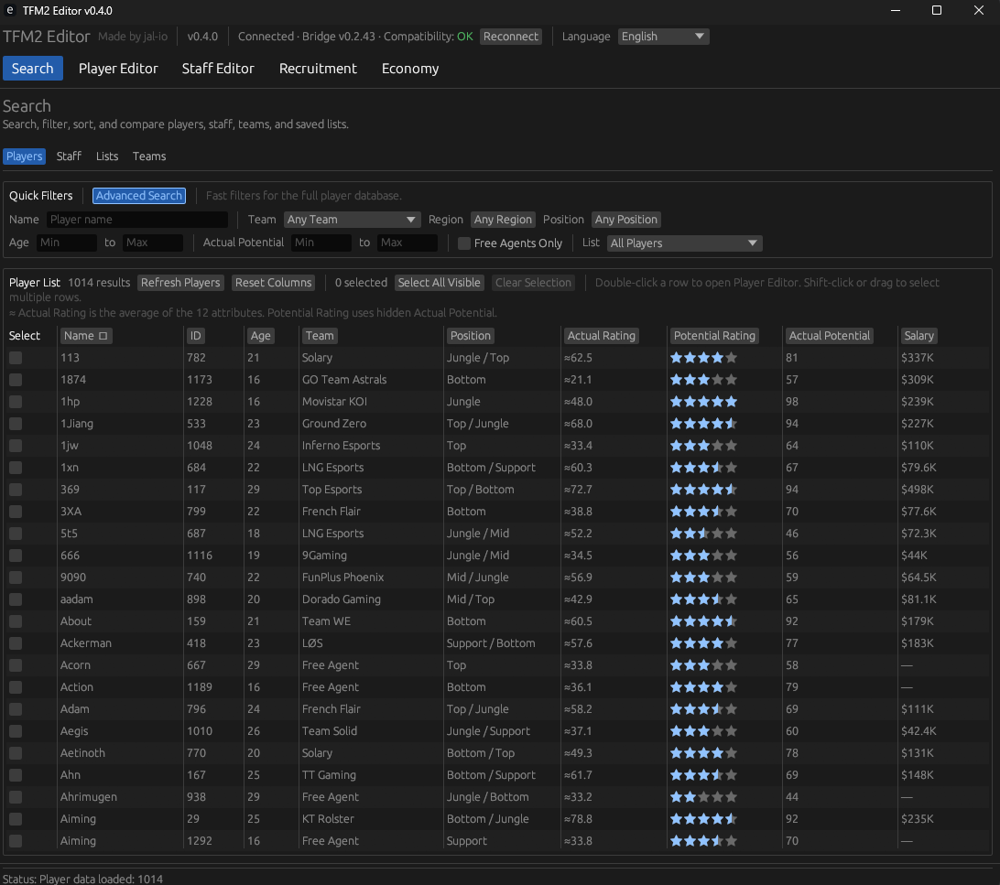
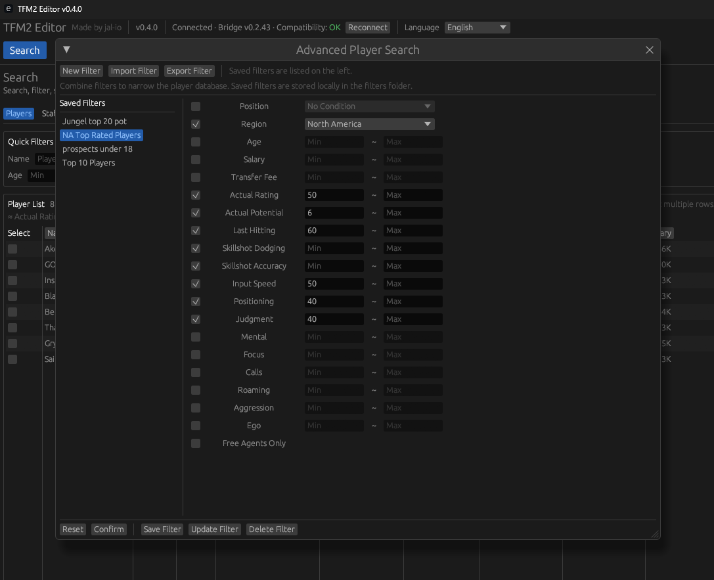
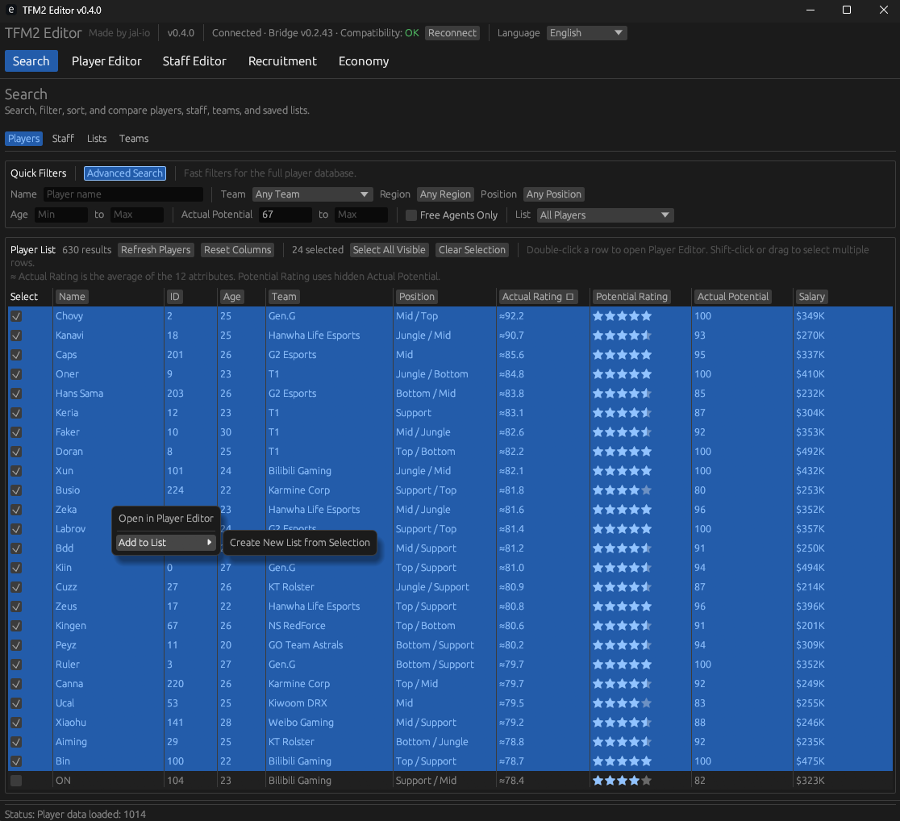
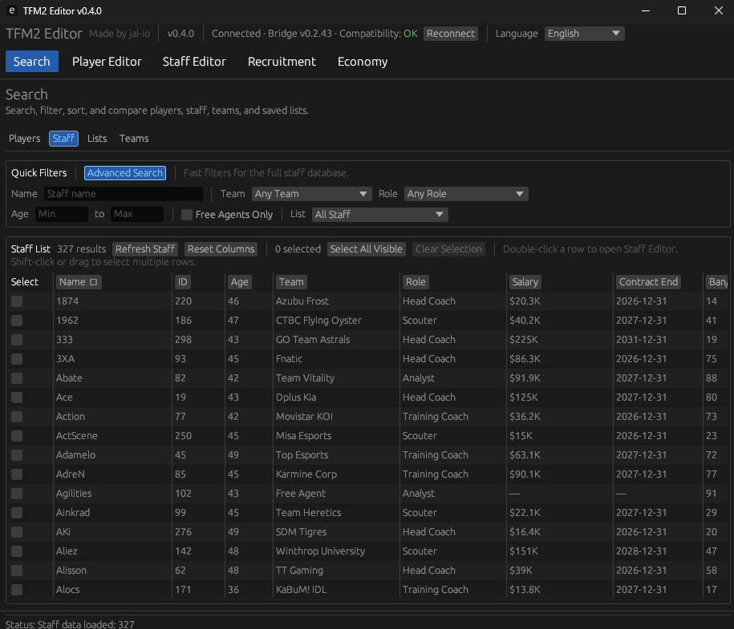
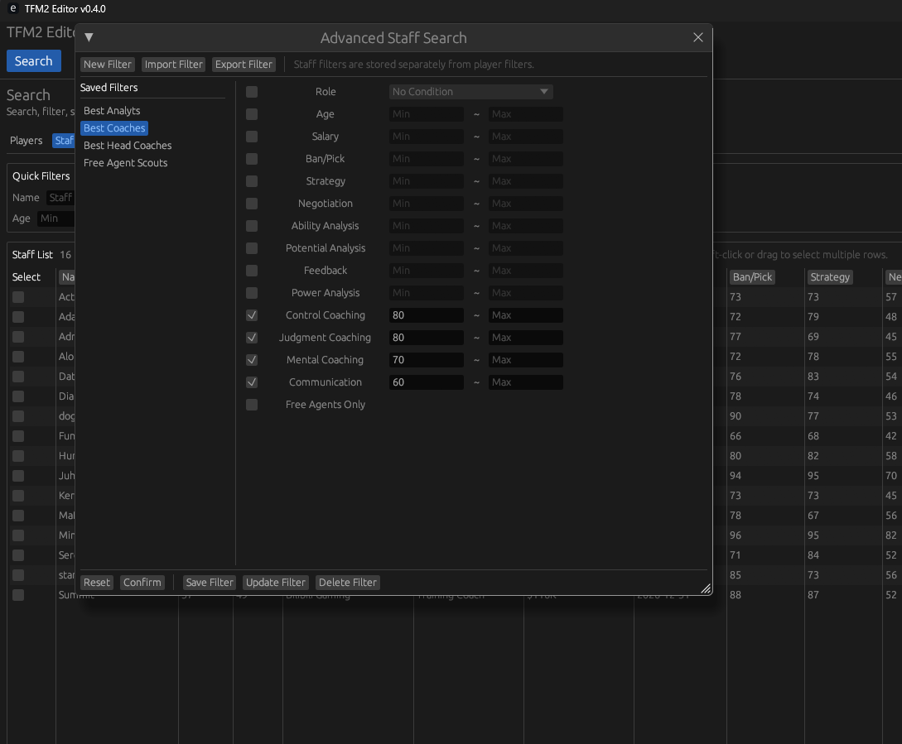
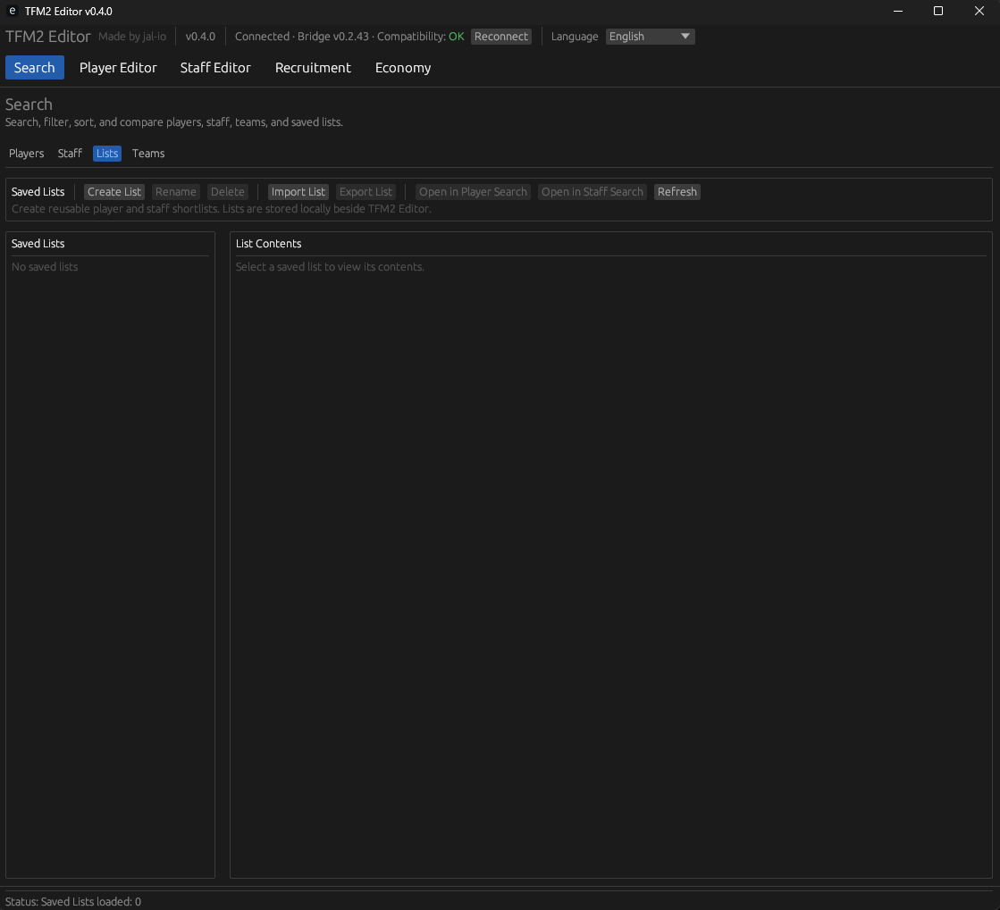
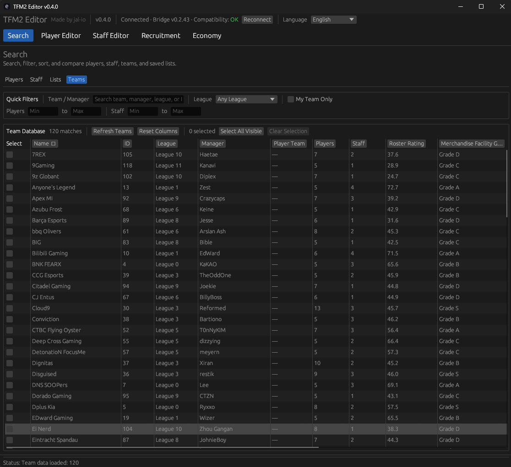
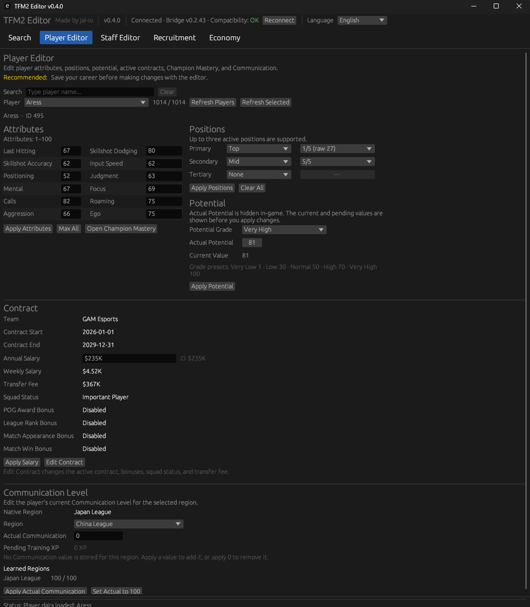
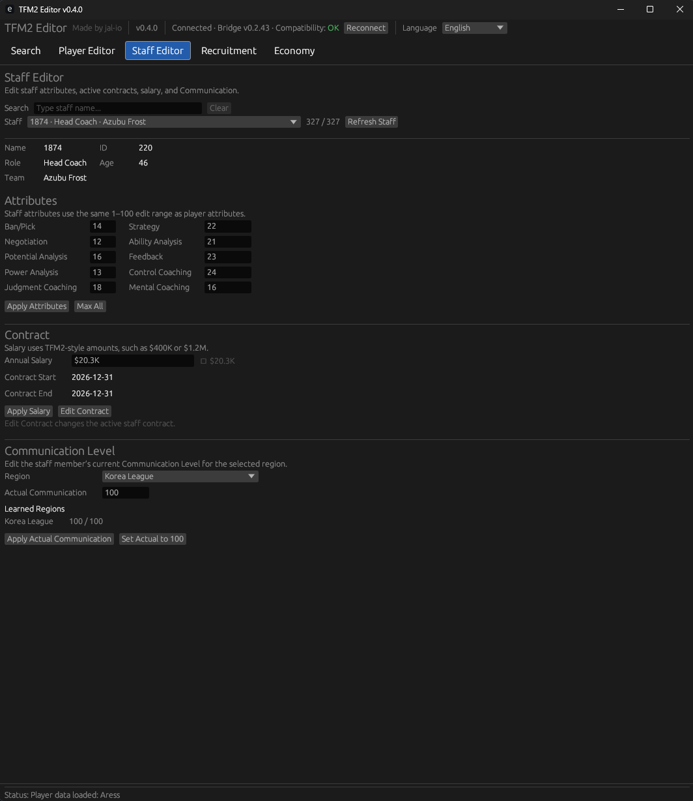

# TFM2 Editor Features

This page gives an overview of the main features available in **TFM2 Editor v0.4.0**.

> **Supported game version:** Teamfight Manager 2 v0.5.3
> **Bridge version:** TFM2 Editor Bridge v0.2.43

---

## Compatibility Status

TFM2 Editor now permanently shows the detected Bridge version and compatibility state in the header.

Possible states:

- **Compatibility: OK**
- **Compatibility: Warning**
- **Compatibility: Not Supported**

Known unsupported combinations are blocked automatically to protect the active career from unsafe reads or writes.

---

## Search Overview

The **Search** workspace now includes four sections:

- **Players**
- **Staff**
- **Lists**
- **Teams**

All search pages support consistent blue multi-selection behavior.

You can:

- click rows to select
- click-drag to select or deselect
- use **Shift-click**
- use **Shift-drag**
- use **Select All Visible**
- use **Clear Selection**

---

## Player Search

The **Players** page lets you browse, filter, sort, and compare the player database.

The table includes:

- player identity
- age
- team
- position
- Actual Rating
- Potential Rating
- Actual Potential
- salary
- contract-related fields
- the 12 core player attributes

### Quick Filters

Quick Filters support:

- Name
- Team
- Region
- Position
- Age
- Actual Potential
- Free Agents Only
- Saved List filtering

### Advanced Player Search

Advanced Player Search lets you combine multiple conditions to narrow the player database.

Supported filter groups include:

- Position
- Region
- Age
- Salary
- Transfer Fee
- Actual Rating
- **Actual Potential**
- all 12 player attributes
- Free Agents Only

Saved Filters support create, load, update, delete, import, and export.

**Actual Potential Min/Max** is included in Advanced Player Search and is saved in `.tfm2filter` files.

### Direct actions

Player Search also supports:

- double-click to open **Player Editor**
- right-click to open the selected player
- right-click to add selected players to a Saved List
- create a new Saved List from the current selection

---

## Staff Search

The **Staff** page provides a full database-style search for staff members.

The table includes:

- identity
- age
- team
- role
- salary
- contract end
- Ban/Pick
- Strategy
- Negotiation
- other supported staff attributes

### Quick Filters

Quick Filters support:

- Name
- Team
- Role
- Age
- Free Agents Only
- Saved List filtering

### Advanced Staff Search

Advanced Staff Search supports:

- Role
- Age
- Salary
- Ban/Pick
- Strategy
- Negotiation
- Ability Analysis
- Potential Analysis
- Feedback
- Power Analysis
- Control Coaching
- Judgment Coaching
- Mental Coaching
- Communication
- Free Agents Only

Staff filters are stored separately from player filters.

---

## Saved Lists

The **Lists** page stores reusable player and staff shortlists.

Saved Lists support:

- create
- rename
- delete
- import
- export
- open in Player Search
- open in Staff Search

Lists are shared between Player Search and Staff Search and use the `.tfm2list` format.

---

## Teams Search

The **Teams** page is included as a database and selection tool.

It includes:

- team name
- team ID
- league
- manager
- player count
- staff count
- roster rating
- money-related data
- facility grades

Quick Filters support:

- team / manager search
- league
- My Team Only
- player count range
- staff count range

> Teams Search is included in Community v0.4.0 as a database and selection workspace.
> A dedicated Team editing workspace will return later when it contains real Team features.

---

## Player Editor

The **Player Editor** lets you search for a player and edit supported active-career data.

### Layout

Community v0.4.0 uses the approved compact two-column layout:

- **Attributes** on the left
- **Positions** and **Potential** on the right
- **Contract** and **Communication Level** below

This keeps the most-used editing tools near the top of the editor.

### Attributes

Edit all 12 player attributes from 1–100.

Available actions:

- **Apply Attributes**
- **Max All**

### Positions

Edit up to three active positions:

- Primary
- Secondary
- Tertiary

You can also edit the proficiency value for each active position.

Available actions:

- **Apply Positions**
- **Clear All**

### Potential

TFM2 Editor can read and edit the player's hidden **Actual Potential** value.

The section shows:

- Potential Grade
- Actual Potential
- Current Value

The Potential Grade updates automatically when the value changes.

### Champion Mastery

Champion Mastery is now opened directly from the Player Editor through **Open Champion Mastery**.

You can:

- edit individual mastery values
- check Active or Inactive champions
- check all or clear checks
- apply a bulk mastery value
- apply changes only to checked champions

### Contract

The Contract section displays the current active contract.

It includes:

- team
- contract start
- contract end
- annual salary
- weekly salary
- transfer fee
- squad status
- POG Award Bonus
- League Rank Bonus
- Match Appearance Bonus
- Match Win Bonus

You can use:

- **Apply Salary**
- **Edit Contract**

### Communication Level

The Player Communication section is simplified in v0.4.0.

It shows:

- Native Region
- Region selector
- Actual Communication
- Pending Training XP
- Learned Regions

Available actions:

- **Apply Actual Communication**
- **Set Actual to 100**

**Pending Training XP** is shown as read-only information.
It is separate from the current 0–100 **Communication Level** shown in the player profile.

---

## Staff Editor

The **Staff Editor** lets you search for staff members and edit supported active-career data.

### Attributes

Edit all supported staff attributes from 1–100.

Available actions:

- **Apply Attributes**
- **Max All**

Supported staff attributes include:

- Ban/Pick
- Negotiation
- Potential Analysis
- Power Analysis
- Judgment Coaching
- Strategy
- Ability Analysis
- Feedback
- Control Coaching
- Mental Coaching

### Contract

The Staff Contract section displays:

- Annual Salary
- Contract Start
- Contract End

You can use:

- **Apply Salary**
- **Edit Contract**

### Communication Level

The Staff Communication section now uses the same clearer presentation as the Player Editor.

It shows:

- Region
- Actual Communication
- Learned Regions

Available actions:

- **Apply Actual Communication**
- **Set Actual to 100**

---

## Recruitment

The **Recruitment** tab contains recruitment tools and direct player / staff management.

### Recruitment tools
- Transfer Always Success
- Instant Retry

### Player Management
Player Management supports:

- moving contracted players between teams
- setting contracted players to Free Agent
- creating a contract and moving a free-agent player to a selected team

### Staff Management
Staff Management supports:

- moving contracted staff between teams
- setting contracted staff to Free Agent
- creating a contract and moving a free-agent staff member to a selected team

For free agents, the contract form is filled with valid default values before the move is applied.

---

## Economy

The **Economy** tab lets you edit the active team's financial values.

You can edit:

- Money
- Recruitment Budget
- Salary Budget

Community v0.4.0 uses compact TFM2-style money formatting with live previews.

Examples include:

- `$400K`
- `$2.5M`
- `$1B`

---

## Mod Compatibility

TFM2 Editor v0.4.0 was validated successfully with:

- **Real World Database '26**
- **League of Legends Champions by Silverbear**
- **Item Scroller**
- **Riot Games Item Expansion Pack**

Player, staff, team, and champion data are loaded dynamically from the active database.

---

## Known limitations

- Champion Mastery can reopen too large after high mastery values
- Champion Mastery can auto-maximize near the right edge of the main window
- Team editing workspace is not included in v0.4.0
- History / stats-over-time views are not included
- Full contract renewal is not included; editing applies to the active contract

---

## Important

Always back up your save files before using TFM2 Editor.

Editing game data may cause unexpected behavior or save corruption.

TFM2 Editor is an unofficial community project and is not affiliated with or endorsed by Team Samoyed.
