# TFM2 Editor Features

This page covers the main features available in **TFM2 Editor v0.5.0**.

> **TFM2 Editor:** v0.5.0  
> **TFM2 Editor Bridge:** v0.2.59  
> **Supported game version:** Teamfight Manager 2 v0.5.5

The main Community tabs are:

```text
Search · Player Editor · Staff Editor · Team · Transfers · Economy
```

---

## Search

The Search workspace provides database-style views for:

- **Players**
- **Staff**
- **Lists**
- **Teams**

Search pages support filtering, sorting, resizable columns, multi-selection and direct navigation to the matching editor where applicable.

### Player Search

Player Search provides a full view of the active player database.

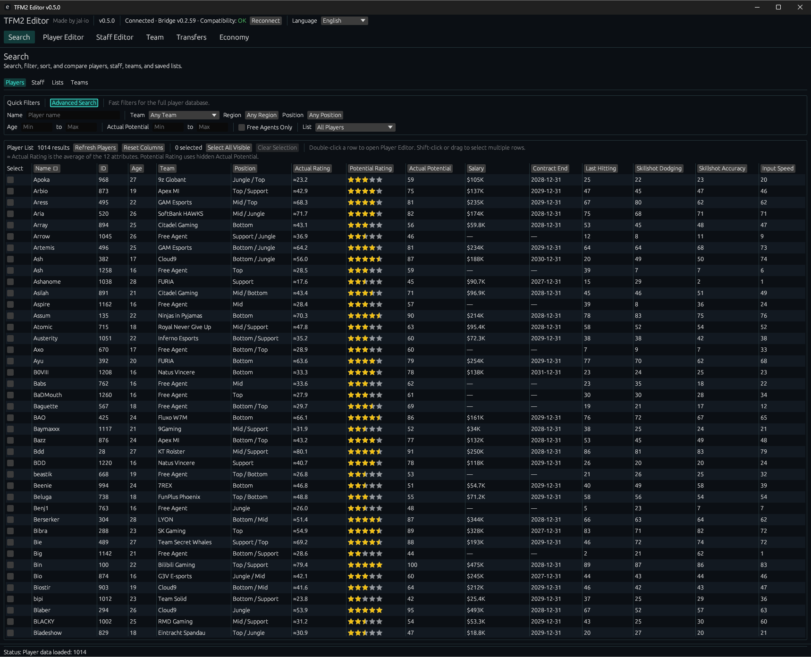

The table includes:

- player identity
- ID and age
- team and position
- Actual Rating
- Potential Rating
- Actual Potential
- salary
- contract end
- all 12 player attributes

Quick Filters can narrow the database by common values such as name, team, region, position, age, Actual Potential and free-agent status.

Player Search also supports full-row selection and direct opening of a player in Player Editor.

### Advanced Player Search

Advanced Player Search combines multiple enabled conditions to narrow the player database.

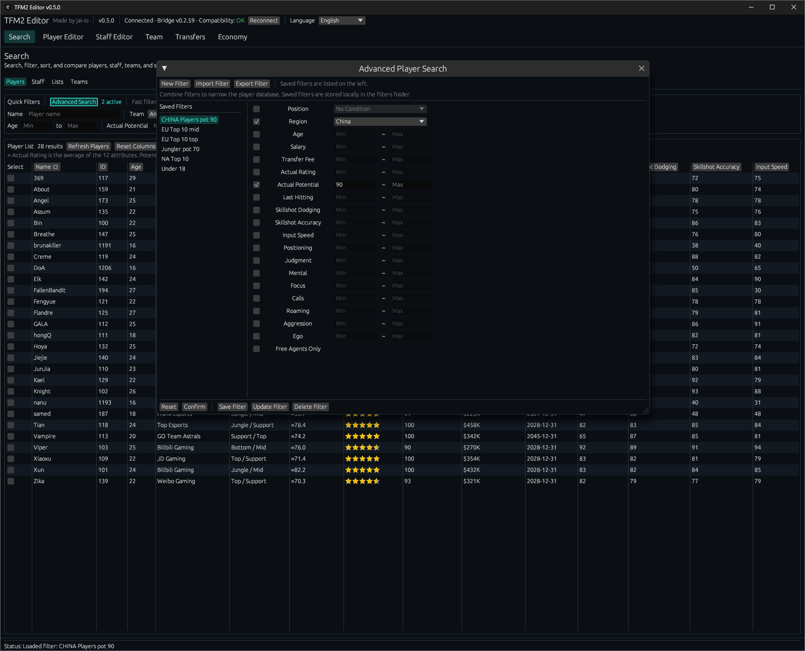

Filter groups include:

- Position
- Region
- Age
- Salary
- Transfer Fee
- Actual Rating
- Actual Potential
- all 12 player attributes
- Free Agents Only

Saved Filters can be created, loaded, updated, deleted, imported and exported.

### Staff Search

Staff Search provides a database-style view of the active staff database.

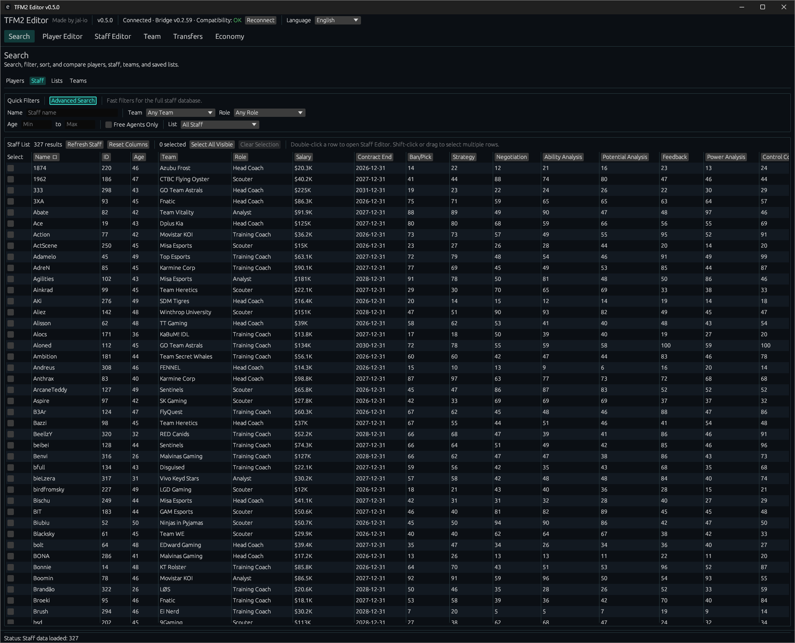

The table includes:

- identity
- ID and age
- team
- role
- salary and contract end
- Ban/Pick
- Strategy
- Negotiation
- Ability Analysis
- Potential Analysis
- Feedback
- Power Analysis
- Control Coaching
- Judgment Coaching
- Mental Coaching
- Communication

Staff Search supports the same database workflow as Player Search, including sorting, filtering, multi-selection and direct Staff Editor navigation.

### Saved Lists

Saved Lists provide reusable player and staff shortlists.

Lists support:

- create
- rename
- delete
- add selected players or staff
- remove entries
- import
- export
- open in the matching Search page

### Teams Search

Teams Search provides a searchable database of teams in the active career.

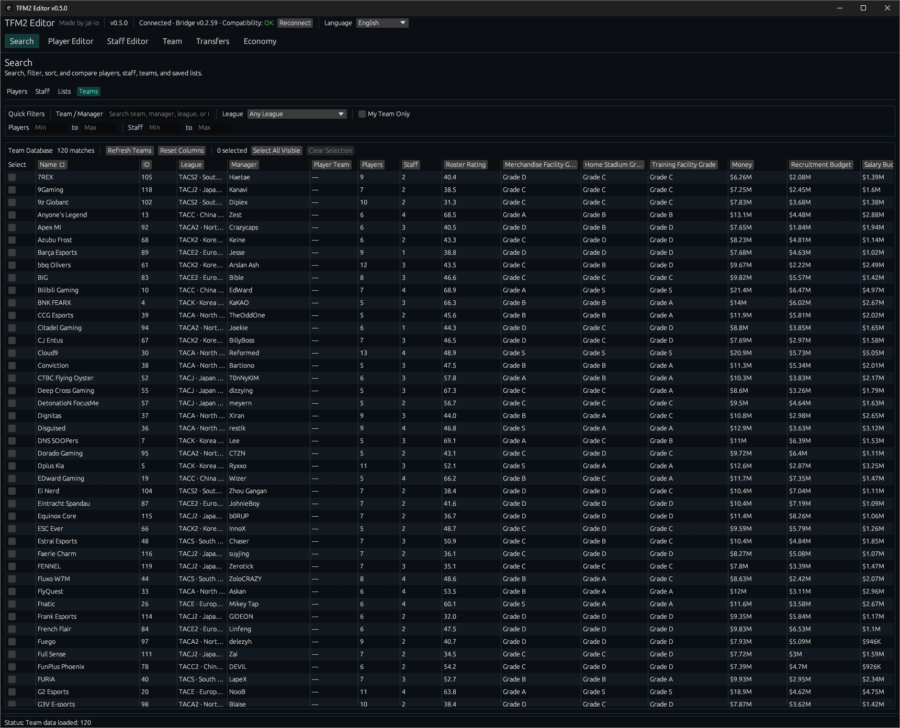

Displayed team information includes:

- team name and ID
- league
- manager
- player-team state
- player and staff counts
- roster rating
- facility grades
- Money
- Recruitment Budget
- Salary Budget

Teams Search can be used to find and select teams before working with Team or transfer-management tools.

---

## Player Editor

Player Editor lets you inspect and edit supported player data in the active career.

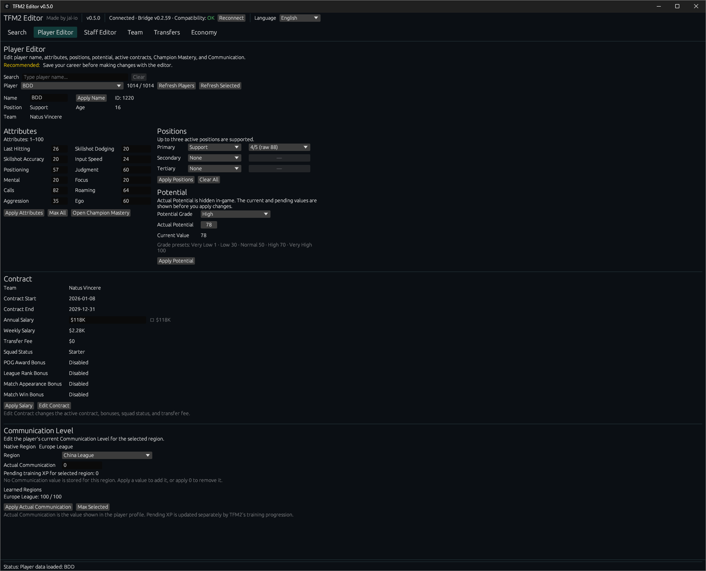

### Identity

The identity section includes:

- Name
- ID
- Position
- Age
- Team

Player names can be edited directly.

### Attributes

All 12 player attributes can be edited from 1–100:

- Last Hitting
- Skillshot Dodging
- Skillshot Accuracy
- Input Speed
- Positioning
- Judgment
- Mental
- Focus
- Calls
- Roaming
- Aggression
- Ego

Available actions include **Apply Attributes** and **Max All**.

### Positions

Edit up to three active positions:

- Primary
- Secondary
- Tertiary

Position proficiency can also be changed.

### Actual Potential

Player Editor can read and edit the hidden **Actual Potential** value.

Potential Grade updates with the selected value before the change is applied.

### Champion Mastery

Champion Mastery is available directly from Player Editor.

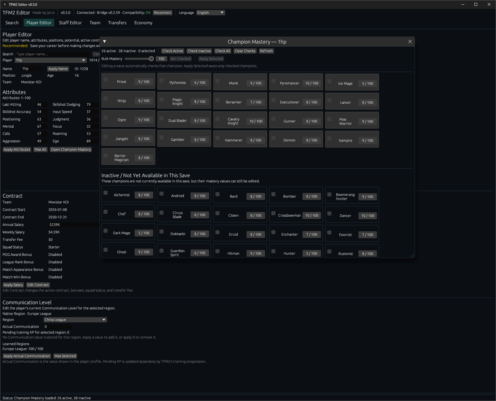

The champion pool is loaded dynamically from the active game database.

Champion Mastery supports:

- active and inactive champion groups
- individual mastery values
- Check Active
- Check Inactive
- Check All
- Clear Checks
- bulk mastery values
- applying changes to selected champions

### Active contract

Player Editor shows the player's active contract, including supported salary, transfer-fee, squad-status and bonus information.

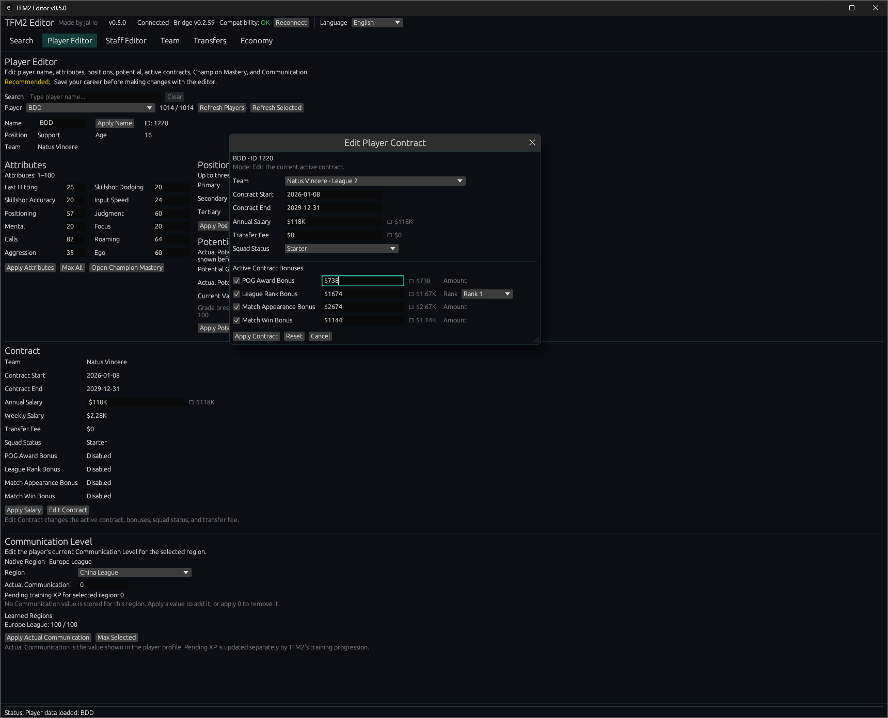

Supported contract editing includes:

- contract start
- contract end
- annual salary
- transfer fee
- Squad Status
- POG Award Bonus
- League Rank Bonus
- Match Appearance Bonus
- Match Win Bonus

### Communication Level

Player Communication Level can be viewed and edited by region.

The section keeps the current Communication Level separate from Pending Training XP.

---

## Staff Editor

Staff Editor provides editing for supported staff data.

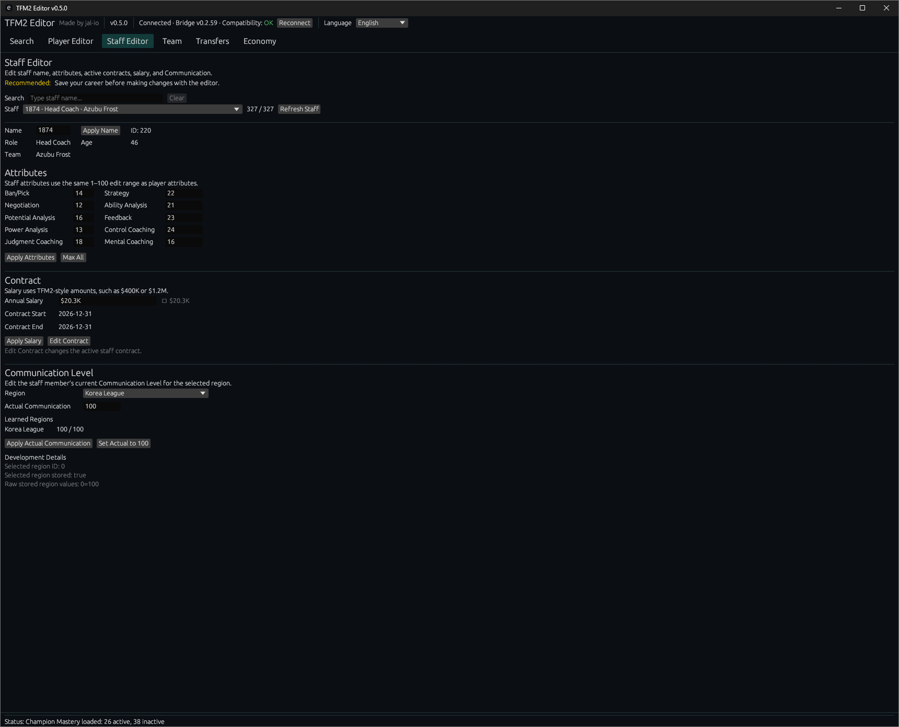

The editor includes:

- staff name
- ID
- role
- age
- team
- all supported staff attributes
- salary
- active contract
- Communication Level

Supported staff attributes include:

- Ban/Pick
- Strategy
- Negotiation
- Ability Analysis
- Potential Analysis
- Feedback
- Power Analysis
- Control Coaching
- Judgment Coaching
- Mental Coaching

---

## Team workspace

TFM2 Editor v0.5.0 adds the expanded **Team** workspace to the Community release.


The main Team view combines team management and career information in one workspace.

### Team overview

The Team workspace can show:

- team identity
- league
- manager
- player-team state
- roster and staff counts
- roster rating
- last starting lineup
- watched and release-list information
- stadium information
- Money, Recruitment Budget and Salary Budget
- fans
- facilities
- Team Summary
- Gaming House information
- League Standings

### Team Members

The Team Members menu provides access to roster, staff and condition tools.

### Team Condition

Team Condition lets you inspect and edit stamina and condition for the selected team's players.

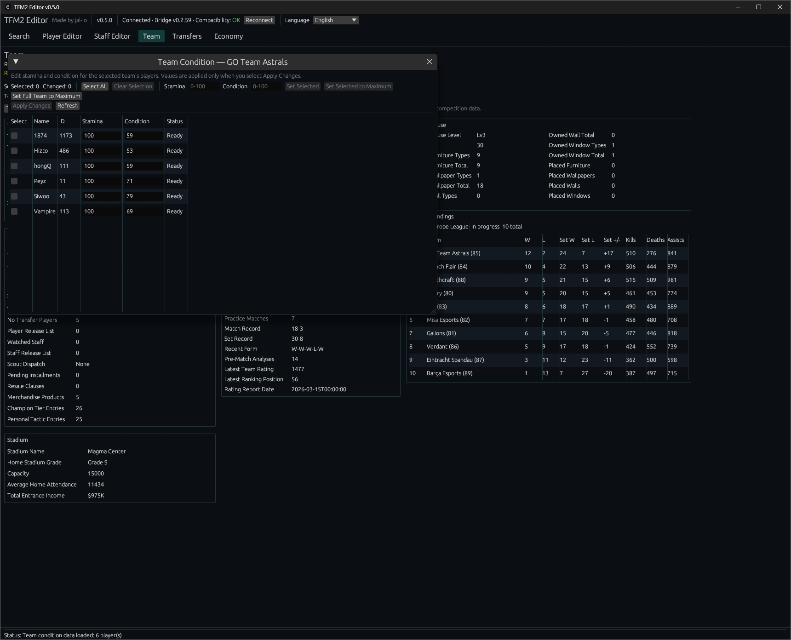

Available actions include:

- select individual players
- select the full roster
- set selected players to a chosen stamina / condition value
- set selected players to maximum
- set the full team to maximum
- apply changes

### Contract Center

The Team Contract Center combines active player and staff contracts for the selected team.

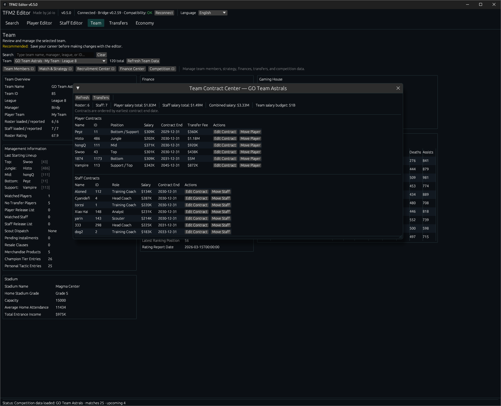

It shows player and staff contract information and provides direct actions for supported contract editing and team moves.

### Finance Center

Team Finance Center provides a detailed financial overview.

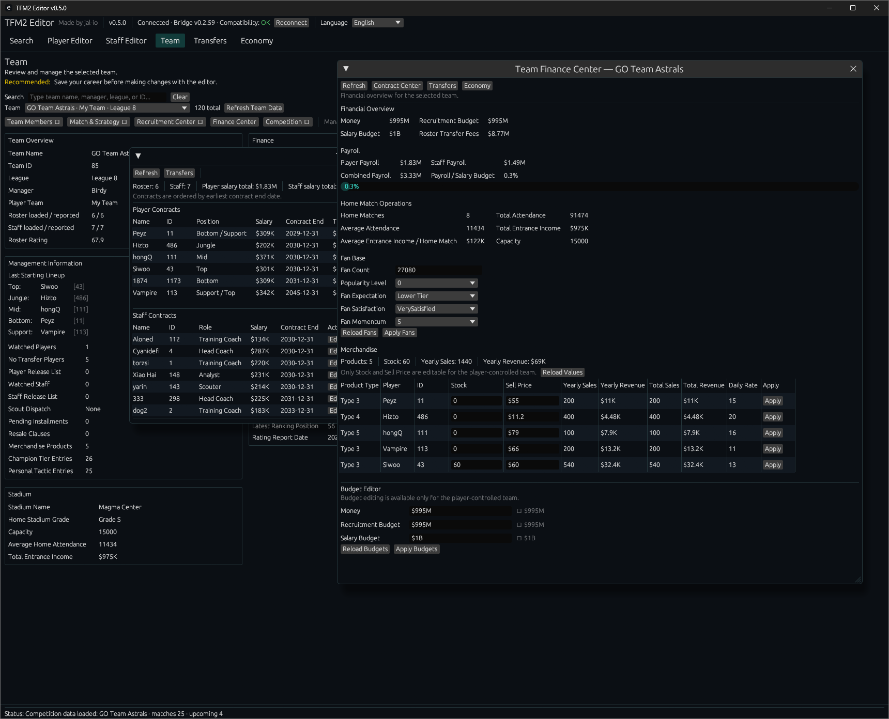

The Finance Center includes:

- Money
- Recruitment Budget
- Salary Budget
- roster transfer fees
- player payroll
- staff payroll
- combined payroll
- payroll / salary-budget comparison
- home-match attendance and entrance income
- fan information
- merchandise products, stock, price and sales information
- budget editing for the player-controlled team

### Competition and Match History

The Competition tools provide access to team competition information and completed match history.

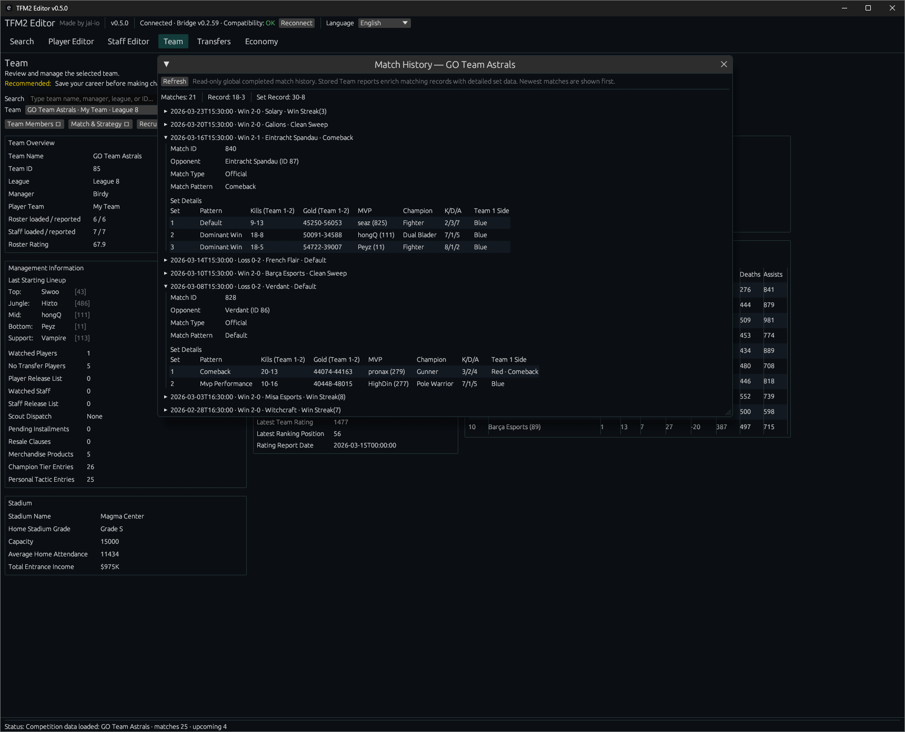

Match History can show:

- match date
- result and score
- opponent
- match type
- match pattern
- available set details
- kills
- gold
- MVP
- champion
- K/D/A
- team side

Newest matches are shown first.

### Team Stats

Team Stats provides league-performance information for the current roster and champion usage.

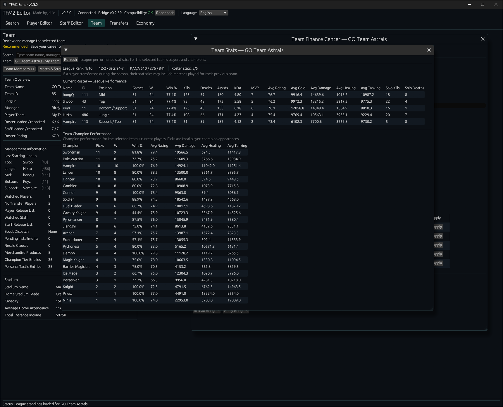

Player performance can include:

- games
- wins
- win percentage
- kills
- deaths
- assists
- KDA
- MVP
- average rating
- average gold
- average damage
- average healing
- average tanking
- solo kills and solo deaths

Champion performance can include picks, wins, win percentage, average rating and combat-performance averages.

### Match & Strategy

Team strategy tools include Strategy Presets and historical analysis.

Historical analysis is based on observed completed-match evidence and is intended to show what has worked in the career history rather than guarantee an optimal future strategy.

### Historical Performance and Historical Synergy

Team Tactics Analysis summarizes historical Strategy performance and combinations.

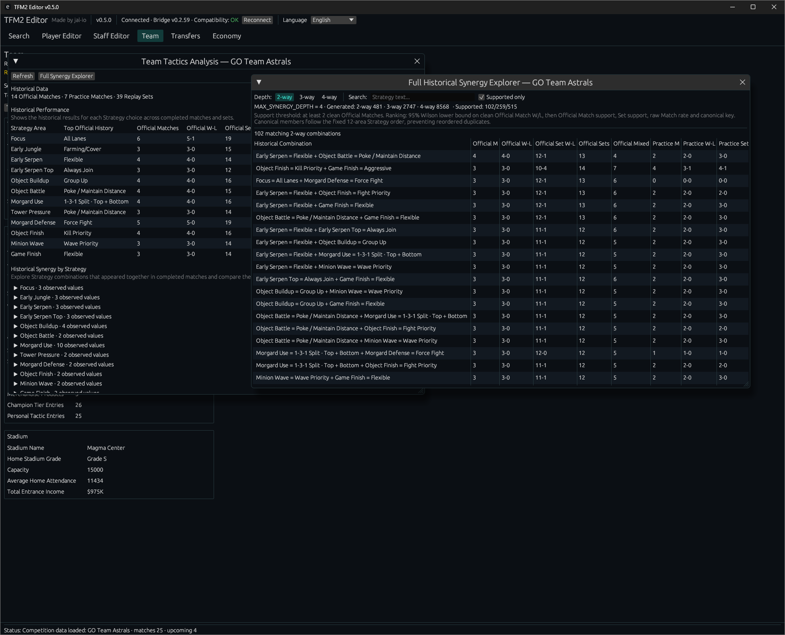

The analysis keeps **Official** and **Practice** evidence distinguishable.

Historical Performance shows results for individual Strategy choices.

Historical Synergy examines Strategy choices that appeared together in supported historical evidence.

The **Full Historical Synergy Explorer** supports browsing combinations up to the currently supported analysis depth, including 2-way, 3-way and 4-way combinations.

Where detailed historical Strategy evidence is unavailable, the Editor does not invent missing set-level Strategy data.

---

## Transfers

The **Transfers** tab contains negotiation helpers and direct player / staff management.

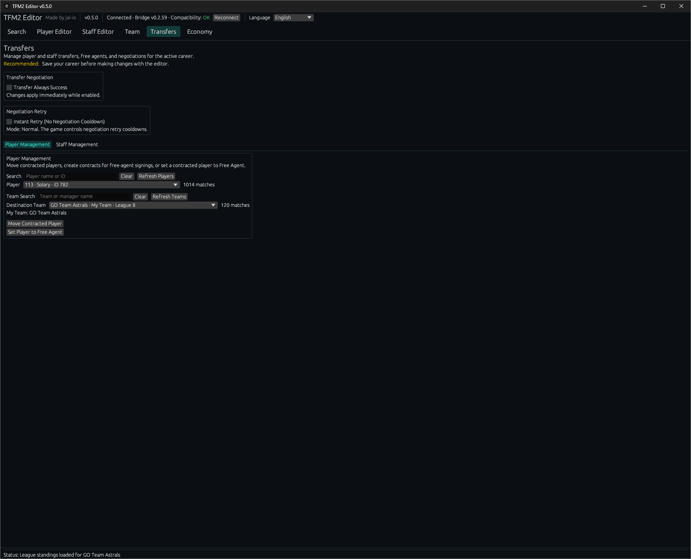

### Transfer Negotiation

- **Transfer Always Success**

### Negotiation Retry

- **Instant Retry (No Negotiation Cooldown)**

### Player Management

Supported player management includes:

- moving contracted players
- setting contracted players to Free Agent
- creating a contract for supported free-agent moves

### Staff Management

Supported staff management includes:

- moving contracted staff
- setting contracted staff to Free Agent
- creating a contract for supported free-agent moves

---

## Economy

The Economy tab provides direct editing for the active team's core financial values.

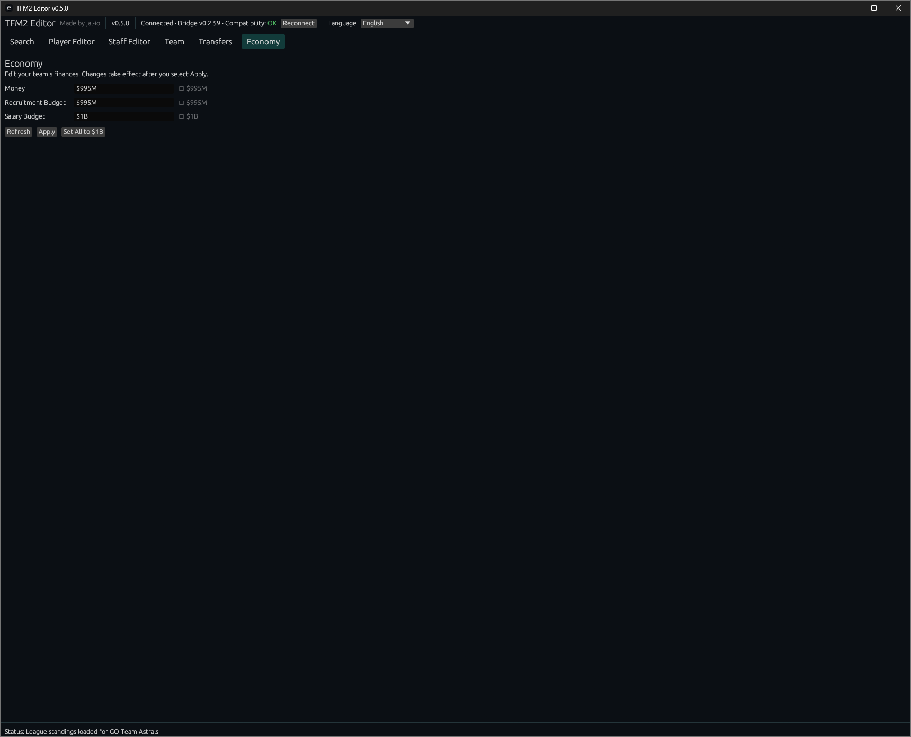

Supported values include:

- Money
- Recruitment Budget
- Salary Budget

The Editor uses compact TFM2-style money input and displays a preview of the value before Apply.

---

## Compatibility safety

TFM2 Editor displays the detected Bridge and compatibility state in the application header.

Possible states include:

- **Compatibility: OK**
- **Compatibility: Warning**
- **Compatibility: Not Supported**

Known unsupported combinations block active game-data access until a compatible Editor and Bridge are active.

For v0.5.0, use:

- **TFM2 Editor v0.5.0**
- **TFM2 Editor Bridge v0.2.59**
- **Teamfight Manager 2 v0.5.5**

The older v0.4.2 generation is not compatible with this release.

---

## Dynamic game data

Player, staff, team and champion data are loaded from the active game database where supported.

This allows the Editor to work with the active career rather than relying only on a fixed hard-coded player, staff, team or champion list.

Compatibility with unrelated gameplay mods depends on how those mods change the underlying game data.

---

## Important

**Recommended: Save your career before making changes with the editor.**

TFM2 Editor modifies data in the active running career. Unexpected game behavior, data loss or save corruption may still be possible.

Use TFM2 Editor at your own risk.

TFM2 Editor is an unofficial community project and is not affiliated with or endorsed by Team Samoyed.
