# TFM2 Editor Features

This page gives a quick overview of the main features available in **TFM2 Editor v0.3.0**.

> **Supported game version:** Teamfight Manager 2 v0.5.3
> **Bridge version:** TFM2 Editor Bridge v0.2.38

---

## Economy

The **Economy** tab lets you edit the active team's financial values.

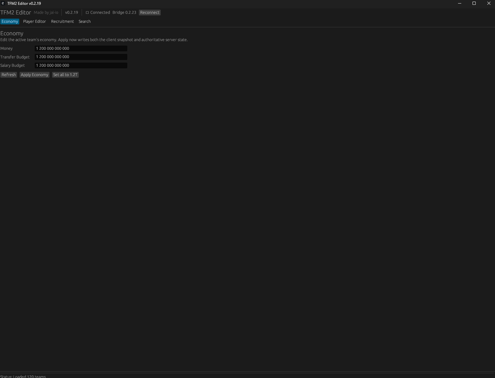

You can edit Money, Transfer Budget, and Salary Budget.

> Economy values use Teamfight Manager 2's internal money units in this version.

---

## Player Editor

The **Player Editor** lets you search for a player and edit several parts of the player's active career data.

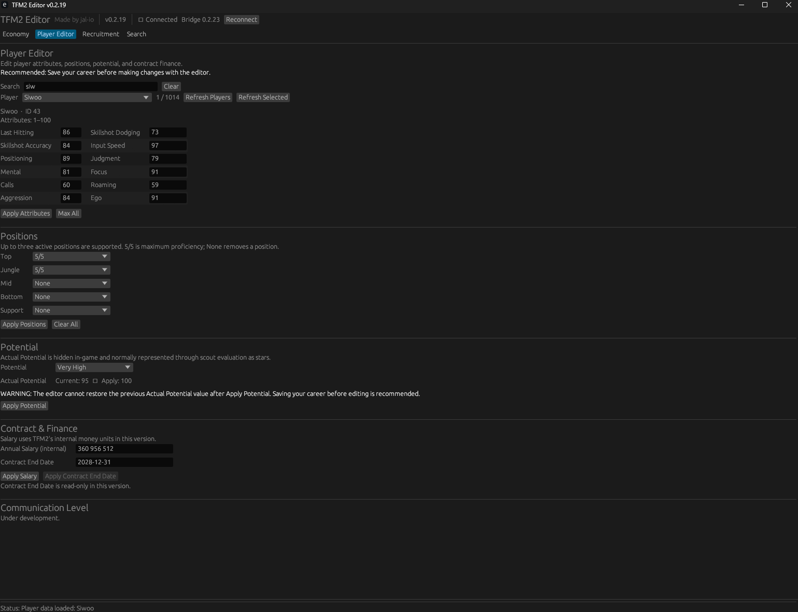

### Attributes

Edit all 12 player attributes from 1–100, apply the current values, or use **Max All**.

### Positions

Edit up to three active positions using **Primary**, **Secondary**, and **Tertiary** slots, with proficiency for each active position.

### Potential

TFM2 Editor can read and edit the player's hidden **Actual Potential** value.

The Potential Grade updates automatically when the Actual Potential value changes.

> Save your career before editing Actual Potential.

### Contract & Finance

The Player Editor now displays the complete active player contract.

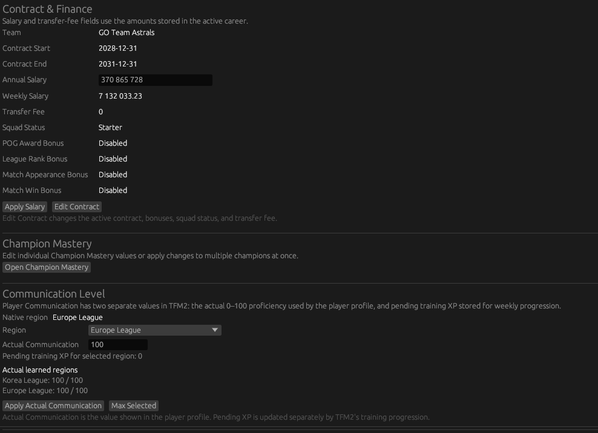

Available contract information includes:

- Current team
- Contract start and end dates
- Annual and weekly salary
- Transfer fee
- Squad Status
- POG Award Bonus
- League Rank Bonus and required rank
- Match Appearance Bonus
- Match Win Bonus

Salary can still be applied directly from the Player Editor.

Use **Edit Contract** to change the active contract.

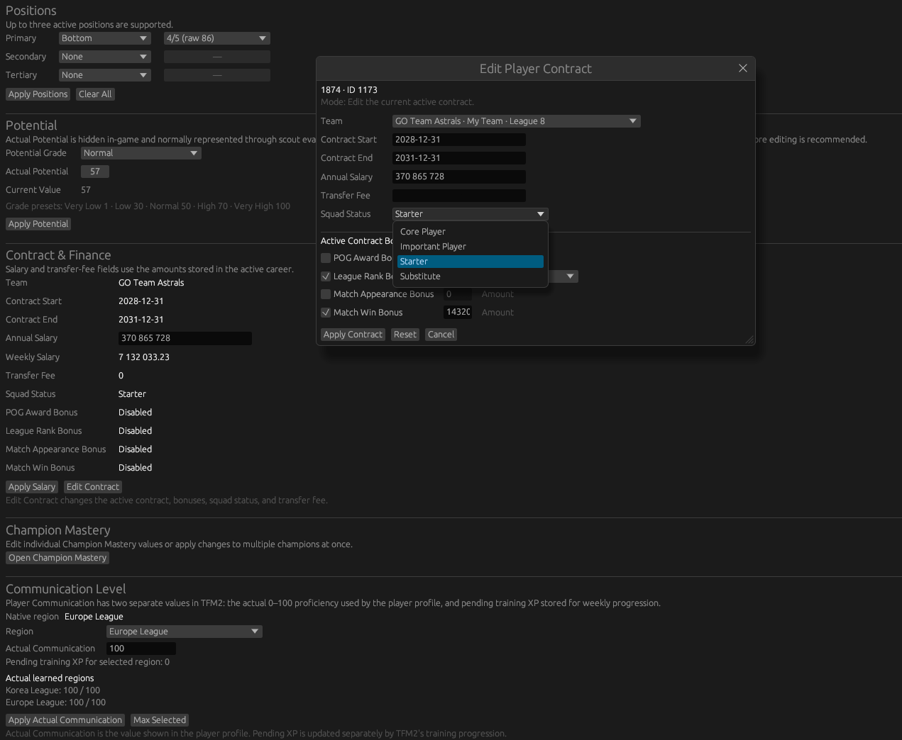

The Player Contract Editor supports:

- Contract start and end dates
- Annual salary
- Transfer fee
- Squad Status
- POG Award Bonus
- League Rank Bonus and required rank
- Match Appearance Bonus
- Match Win Bonus
- Apply Contract
- Reset
- Cancel

**Reset** reloads the current active contract values without applying changes.

> Editing an active contract is supported. Full contract renewal, where the game creates a separate replacement contract, is not included yet.

### Communication Level

Player Communication editing supports:

- Native region display
- Region selection
- Actual Communication from 0–100
- Pending training XP display
- Stored learned regions
- Apply Actual Communication
- Max Selected

Actual Communication updates the value shown in the player profile. Pending training XP is handled separately by Teamfight Manager 2's weekly training progression.

Changes persist through **Proceed** and **Save/Load**.

---

## Champion Mastery

Champion Mastery editing is available from the Player Editor.

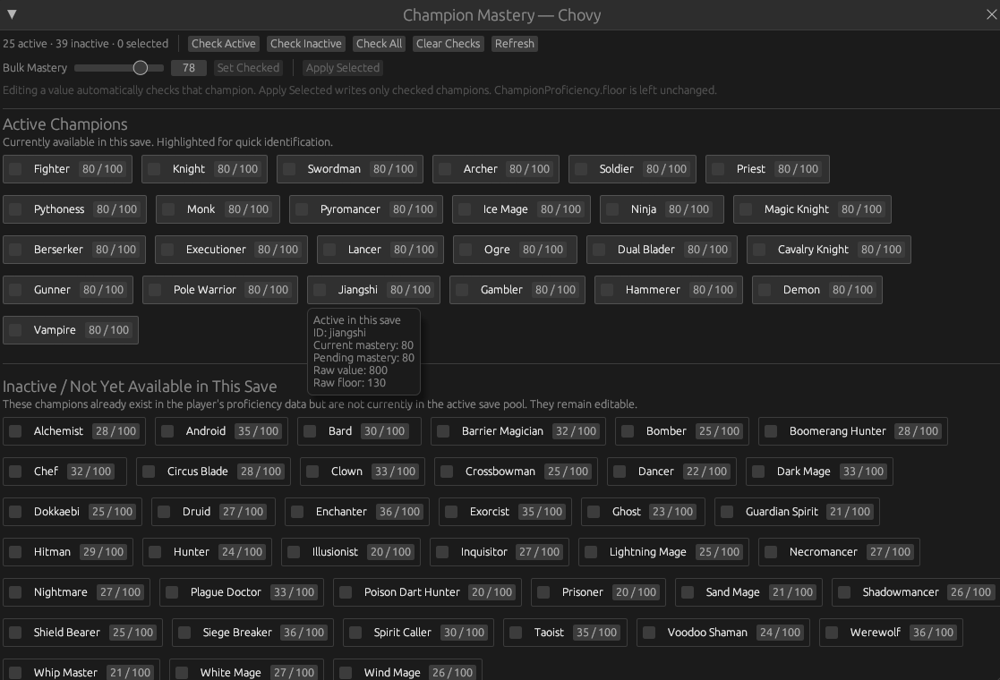

You can:

- Edit individual Champion Mastery values
- Check Active or Inactive champions
- Check All or Clear Checks
- Apply a bulk mastery value to checked champions
- Apply changes only to selected champions

---

## Staff Editor

The **Staff Editor** lets you search for staff members and edit their active career data.

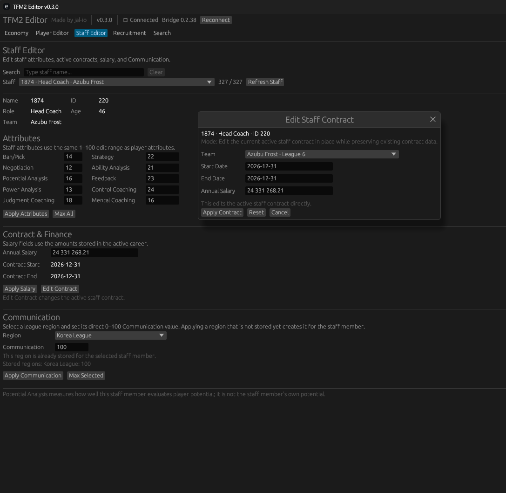

### Staff Attributes

Edit all supported staff attributes from 1–100, apply the current values, or use **Max All**.

Supported staff attributes include:

- Ban/Pick
- Negotiation
- Potential Analysis
- Power Analysis
- Judgment Coaching
- Strategy Ideas
- Ability Analysis
- Feedback
- Control Coaching
- Mental Coaching

### Staff Contract & Finance

The Staff Editor displays:

- Annual salary
- Contract start date
- Contract end date

Use **Edit Contract** to change the active staff contract.

The Staff Contract Editor includes:

- Team
- Start date
- End date
- Annual salary
- Apply Contract
- Reset
- Cancel

Salary editing is disabled for free-agent staff members without an active contract.

### Staff Communication

Staff Communication editing supports:

- Region selection
- Communication from 0–100
- Stored learned regions
- Apply Communication
- Max Selected

Applying a region that is not already stored creates it for the selected staff member.

Changes persist through **Proceed** and **Save/Load**.

---

## Recruitment

The **Recruitment** tab contains transfer negotiation, retry cooldowns, and direct player and staff management tools.

### Recruitment Tools

Available tools include:

- Transfer Always Success
- Instant Retry

### Player Management

Player Management supports:

- Move contracted players between teams
- Set contracted players to free agency
- Create a contract and move a free-agent player to any selected team

When a free-agent player is selected, use **Create Contract & Move Player**.

The contract form is automatically filled with valid starting values. Review or change the contract, then use **Apply Contract & Move Player**.

### Staff Management

Staff Management supports:

- Move contracted staff between teams
- Set contracted staff to free agency
- Create a contract and move a free-agent staff member to any selected team

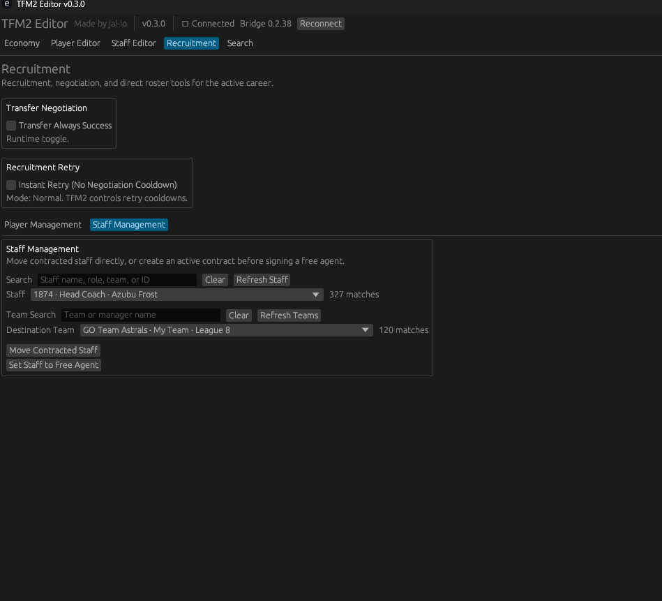

When a free-agent staff member is selected, use **Create Contract & Move Staff**.

The contract form is automatically filled with valid starting values. Review or change the contract, then use **Apply Contract & Move Staff**.

Reset keeps the original contract-window mode and selected destination team.

---

## Player Search

The **Search → Players** view lets you browse, filter, sort, and compare the player database.

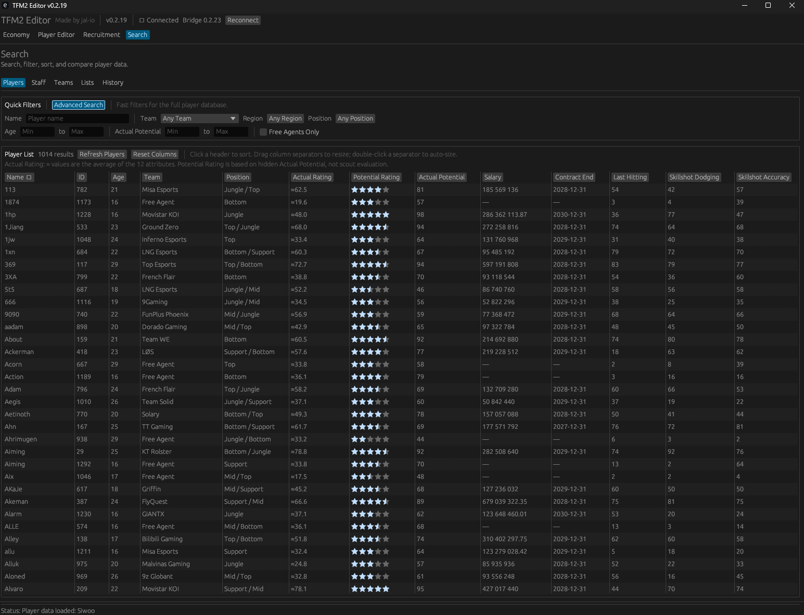

The table includes player identity, team, position, ratings, Actual Potential, salary, contract data, and all 12 attributes.

### Sorting by Actual Rating

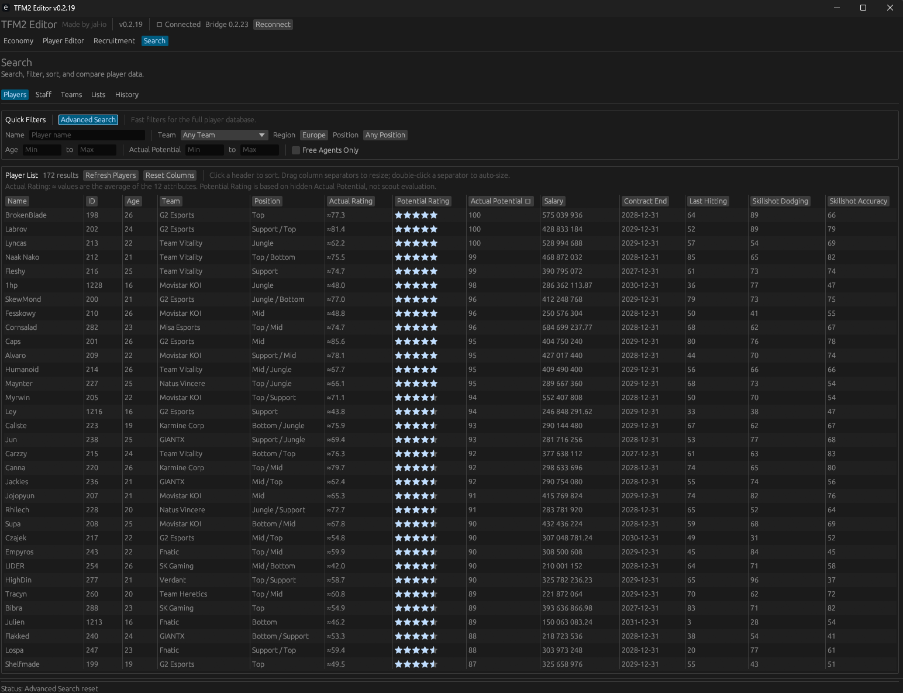

Values marked with `≈` are calculated as the average of the 12 player attributes.

### Quick Filters

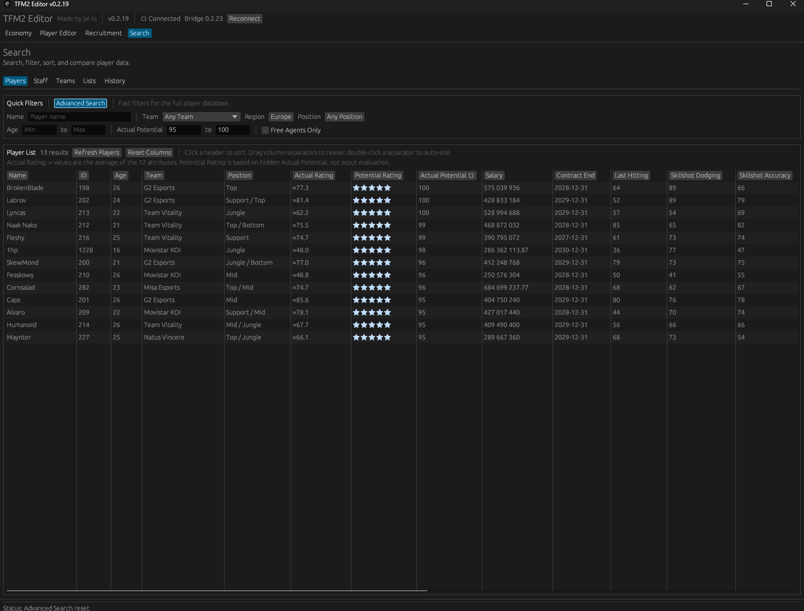

Quick Filters include name, team, region, position, age, Actual Potential, and free-agent status.

### Skill Data

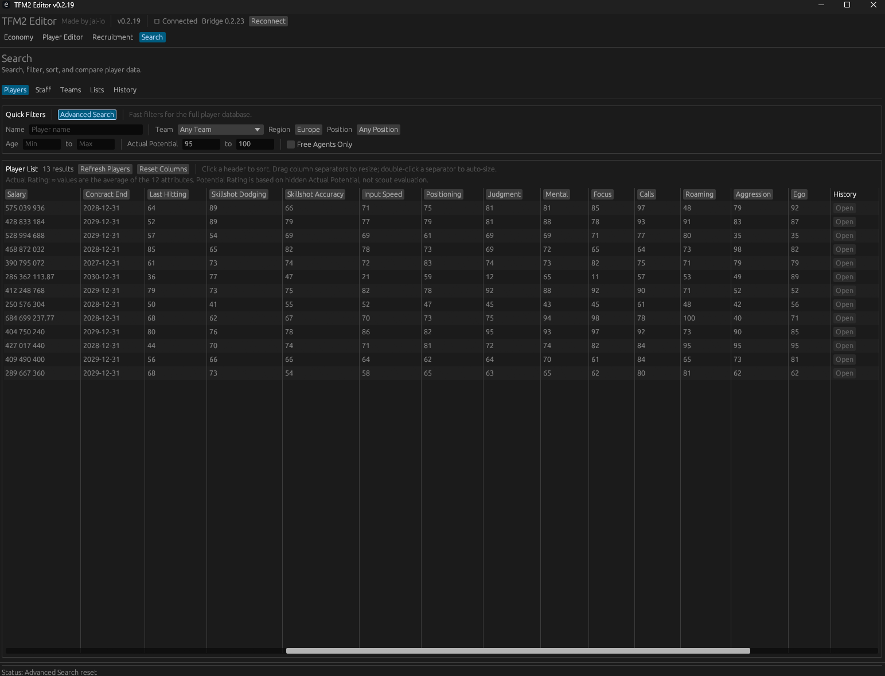

The table can be scrolled horizontally to inspect all player attributes.

---

## Advanced Search

**Advanced Search** lets you combine multiple conditions to narrow the player database.

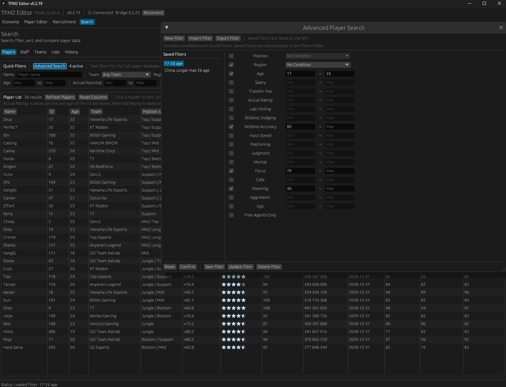

All active conditions are combined using **AND** logic.

### Saved Filters

You can create, save, load, update, delete, import, and export reusable filters.

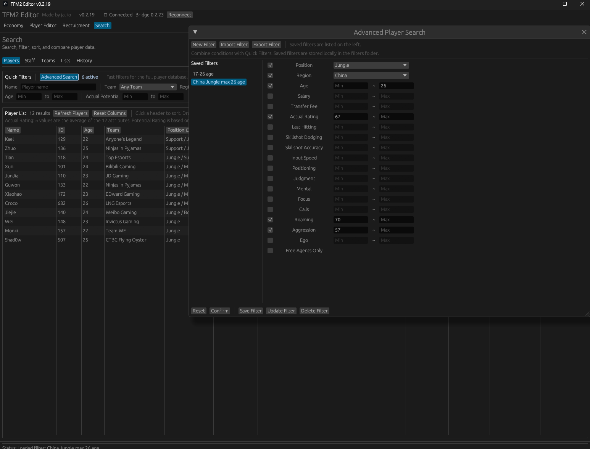

Quick Filters and Advanced Search can be used together.

---

## Important

Always back up your save files before using TFM2 Editor.

Editing game data may cause unexpected behavior or save corruption.

TFM2 Editor is an unofficial community project and is not affiliated with or endorsed by Team Samoyed.
