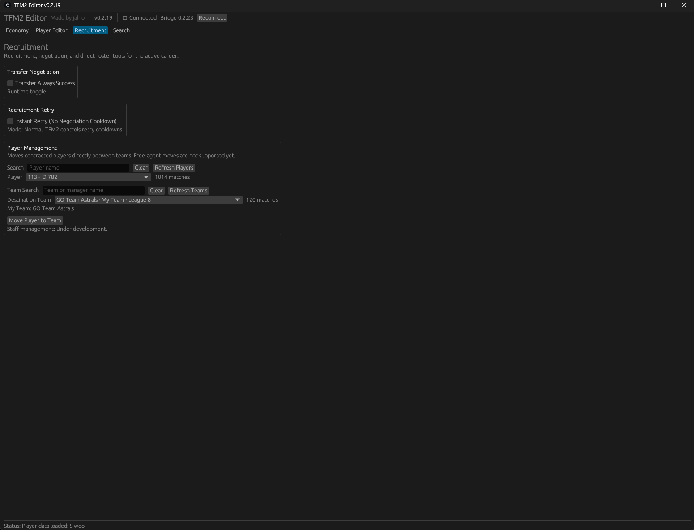

# TFM2 Editor Features

This page gives a quick overview of the main features available in **TFM2 Editor v0.2.19**.

> **Supported game version:** Teamfight Manager 2 v0.5.2

---

## Economy

The **Economy** tab lets you edit the active team's financial values.

You can edit:

- Money
- Transfer Budget
- Salary Budget

Use **Refresh** to reload the current values from the game.

Use **Apply Economy** to write the values to the active career.

The **Set all to 1.2T** button fills all three economy fields with `1 200 000 000 000`.

> Economy values use Teamfight Manager 2's internal money units in this version.

---

## Player Editor

The **Player Editor** lets you search for a player and edit several parts of the player's data.

### Attributes

The editor supports all 12 player attributes:

- Last Hitting
- Skillshot Dodging
- Skillshot Accuracy
- Input Speed
- Positioning
- Judgment
- Mental
- Focus
- Calls
- Roaming
- Aggression
- Ego

Use **Apply Attributes** to save the current values.

Use **Max All** to set all 12 attributes to `100`.

### Positions

You can edit the player's active positions and proficiency.

Up to three active positions are supported.

Setting a position to **None** removes it.

### Potential

**Actual Potential** is hidden in-game and is normally represented through scout evaluation as stars.

TFM2 Editor can read and edit the player's Actual Potential value.

> Changes to Actual Potential cannot currently be restored automatically by the editor. Save your career before editing it.

### Contract & Finance

The editor can:

- Read and edit salary
- Read Contract End Date

Contract End Date is read-only in this version.

### Communication Level

Communication editing is still under development.

---

## Recruitment

The **Recruitment** tab contains tools for transfer negotiation, retry cooldowns, and direct player movement between teams.

### Transfer Always Success

Enable **Transfer Always Success** to force supported transfer negotiations into a successful state.

This is a runtime toggle.

### Instant Retry

Enable **Instant Retry** to remove the normal negotiation retry cooldown.

### Move Player to Team

Search for a contracted player, choose a destination team, and use **Move Player to Team**.

Free-agent moves are not supported yet.

---

## Player Search

The **Search → Players** view lets you browse, filter, sort, and compare the player database.

The table includes information such as:

- Name
- ID
- Age
- Team
- Position
- Actual Rating
- Potential Rating
- Actual Potential
- Salary
- Contract End
- All 12 player attributes

Click a column header to sort.

Drag column separators to resize columns.

Double-click a separator to auto-size it.

### Actual Rating

Values marked with `≈` are calculated as the average of the 12 player attributes.

### Potential Rating

Potential Rating is based on the hidden **Actual Potential** value.

### Sorting by Actual Rating

Player Search can be sorted by any supported column, including Actual Rating.

### Quick Filters

Quick Filters can narrow the database by:

- Name
- Team
- Region
- Position
- Age
- Actual Potential
- Free-agent status

### Skill Data

The table can be scrolled horizontally to inspect all player attributes.

---

## Advanced Search

**Advanced Search** lets you combine multiple conditions to narrow the player database.

Open it from the **Advanced Search** button in the Player Search view.

### Multiple Conditions

You can combine conditions such as:

- Position
- Region
- Age
- Salary
- Transfer Fee
- Actual Rating
- Any of the 12 player attributes
- Free Agents Only

All active conditions are combined using **AND** logic.

### Saved Filters

Advanced Search includes a Saved Filters library.

You can:

- Create a new filter
- Save a filter
- Load a filter
- Update a filter
- Delete a filter
- Import a filter
- Export a filter

Saved filters are stored locally in the `filters` folder.

Quick Filters and Advanced Search can be used together.

---

## Important

Always back up your save files before using TFM2 Editor.

Editing game data may cause unexpected behavior or save corruption.

TFM2 Editor is an unofficial community project and is not affiliated with or endorsed by Team Samoyed.
