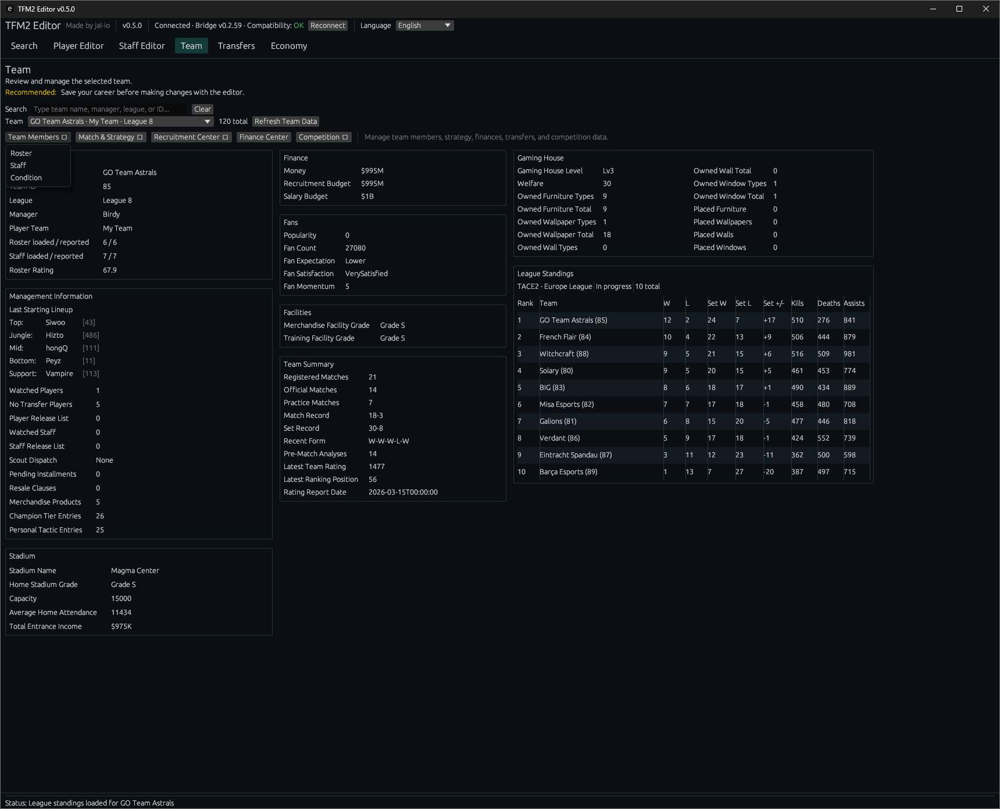

# TFM2 Editor Guide

Welcome to the user guide for **TFM2 Editor**, an unofficial live editor and companion tool for **Teamfight Manager 2**.

Created and maintained by **jal-io**.

> **Current release:** v0.5.0  
> **Required Bridge:** v0.2.59  
> **Supported game version:** Teamfight Manager 2 v0.5.5  
> **Platform:** Windows

[Download the latest release](https://github.com/jal-io/tfm2-editor/releases/latest) ·
[Steam Workshop Bridge](https://steamcommunity.com/sharedfiles/filedetails/?id=3775240765) ·
[Installation](installation.html) ·
[Features and Screenshots](features.html)

## What is TFM2 Editor?

TFM2 Editor connects to the running game through **TFM2 Editor Bridge** and lets you inspect and modify supported data in your active career.

Unlike a traditional save or database editor, TFM2 Editor works with the currently running game. Start Teamfight Manager 2, load your career, then launch the Editor.

## Important installation note

**Subscribing on Steam Workshop installs TFM2 Editor Bridge only.**

The Windows desktop **TFM2 Editor application must be downloaded separately from GitHub Releases**.

- **Steam Workshop:** installs and updates the Bridge mod used by the game
- **GitHub Releases:** provides the Windows desktop Editor application

Both the Editor and Bridge should be kept on the matching release versions.

## Main features in v0.5.0

### Search

- Full **Player Search**
- Full **Staff Search**
- Full **Teams Search**
- Shared **Saved Lists**
- Quick Filters and Advanced Search
- Saved Filters
- Sorting and resizable database columns
- Multi-selection
- Direct Player and Staff Editor navigation

### Player Editor

- Player name editing
- All 12 player attributes
- Primary, Secondary and Tertiary positions
- Position proficiency
- Hidden Actual Potential
- Champion Mastery
- Active contract and salary editing
- Communication Level

### Staff Editor

- Staff name editing
- All supported staff attributes
- Active contract and salary editing
- Communication Level

### Team

v0.5.0 adds the expanded **Team workspace** to the Community release.

It includes:

- Team overview and management information
- Roster and staff tools
- Team Condition
- Contract Center
- Finance Center
- Recruitment Center
- Competition tools
- League Standings
- Match History
- Team Stats
- Strategy tools
- Historical Performance
- Historical Synergy
- Full Historical Synergy Explorer
- Gaming House, facilities, fans and team summary information

### Transfers

- Transfer Always Success
- Instant Retry
- Contracted player and staff moves
- Set contracted players or staff to Free Agent
- Contract creation for supported free-agent moves

### Economy

- Money
- Recruitment Budget
- Salary Budget
- Compact TFM2-style money input and preview

## Compatibility safety

TFM2 Editor displays the detected Bridge and compatibility state in the header.

Known unsupported combinations block active game-data access until a matching Editor and Bridge are installed.

The older **v0.4.2 generation is not compatible with v0.5.0**. Update both the Editor and Bridge together.

## Important

**Recommended: Save your career before making changes with the editor.**

TFM2 Editor modifies data in the active running career. Unexpected behavior, data loss, or save corruption may still be possible.

Use TFM2 Editor at your own risk.

## Bug reports

Report bugs through [GitHub Issues](https://github.com/jal-io/tfm2-editor/issues).

Please include:

- TFM2 Editor version
- TFM2 Editor Bridge version
- Teamfight Manager 2 version
- What you attempted to do
- What you expected
- What happened instead

## Source and attribution

TFM2 Editor and TFM2 Editor Bridge were created and are maintained by **jal-io**.

Copyright © 2026 jal-io.

The project is **source-available** under the repository's custom attribution license.

See the repository [LICENSE](https://github.com/jal-io/tfm2-editor/blob/main/LICENSE) for the full attribution, usage and redistribution terms.

## Disclaimer

TFM2 Editor is an unofficial community project and is not affiliated with or endorsed by Team Samoyed.

Teamfight Manager 2 and related game content belong to their respective rights holders.
